A simple React component to embed Live2D models (via `live2d-widget`) in Next.js projects.

[](https://www.npmjs.com/package/next-live2d)
[](LICENSE)
[](https://github.com/dangtranhuu/next-live2d)
[](https://www.npmjs.com/package/next-live2d)


## ✨ Features

- 🧠 Auto-load [Live2D Widget](https://github.com/xiazeyu/live2d-widget.js)
- ⚙️ Zero-config usage with App Router
- 🎒 Comes with built-in model (`histoire`)
- ✅ SSR-safe using `dynamic(() => import(...), { ssr: false })`

---

## 🚀 Installation

```bash
npm install next-live2d
```


🧩 Usage in Next.js (app/layout.tsx)
```tsx
'use client'

import { Live2DWidget } from 'next-live2d' {/* Import tại đây */}

import { ReactNode } from 'react'
import './globals.css'

export default function RootLayout({ children }: { children: ReactNode }) {
  return (
    <html lang="en">
      <body>
        <main>{children}</main>
        <Live2DWidget modelName="mai" /> {/* Bạn có thể đổi model khác tại đây */}
      </body>
    </html>
  )
}
```

## 🔧 Advanced Usage

Since `v1.4.0`, you can customize the widget with:

`className`: Tailwind or custom CSS classes

`style`: Inline `React.CSSProperties` object

#### Example:
```tsx
<Live2DWidget
  modelName="senko"
  className="bottom-0 right-0 fixed z-50 opacity-80"
  style={{ width: 200, height: 300 }}
/>
```

#### Props


| Prop        | Type                   | Required | Mô tả                                                                 |
|-------------|------------------------|----------|------------------------------------------------------------------------|
| `modelName` | `string`               | ✅       | Name of the model folder (must include `model.json`)                    |
| `className` | `string`               | ❌       | Custom CSS or Tailwind classes applied to the widget container (ví dụ: `fixed bottom-0`)    |
| `style`     | `React.CSSProperties`  | ❌       | Inline styles (e.g., width, height, position)             |

---

## 🧠 Tips

The Live2D widget is rendered into a #live2d-widget DOM element, positioned as fixed by default.

If you pass className or style, they will override the default style.

## 📁 Model Path
By default, the widget looks for:

### 📦 Available Built-in Models

| Model Name           | Preview (coming soon)         | Usage                                |
|----------------------|-------------------------------|--------------------------------------|
| histoire             | 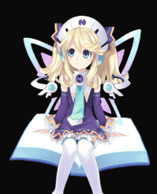    | `<Live2DWidget modelName="histoire" />`             |
| bilibili-22          |      | `<Live2DWidget modelName="bilibili-22" />`          |
| bilibili-33          |     | `<Live2DWidget modelName="bilibili-33" />`          |
| cat-black            | 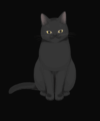    | `<Live2DWidget modelName="cat-black" />`            |
| cat-white            | 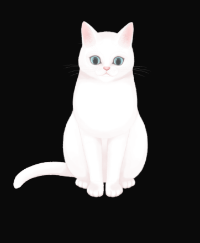   | `<Live2DWidget modelName="cat-white" />`            |
| chino                |    | `<Live2DWidget modelName="chino" />`                |
| date                 | 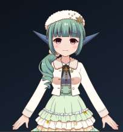      | `<Live2DWidget modelName="date" />`                 |
| hallo                | 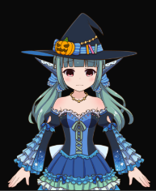       | `<Live2DWidget modelName="hallo" />`                |
| haruto               |         | `<Live2DWidget modelName="haruto" />`               |
| hibiki               | 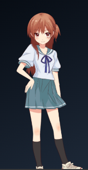     | `<Live2DWidget modelName="hibiki" />`               |
| HK416-1-normal       | 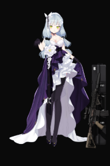      | `<Live2DWidget modelName="HK416-1-normal" />`       |
| HK416-2-destroy      | 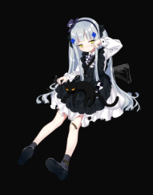   | `<Live2DWidget modelName="HK416-2-destroy" />`      |
| HK416-2-normal       | 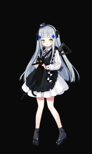     | `<Live2DWidget modelName="HK416-2-normal" />`       |
| Kar98k-normal        | 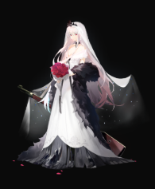  | `<Live2DWidget modelName="Kar98k-normal" />`        |
| kobayaxi             | 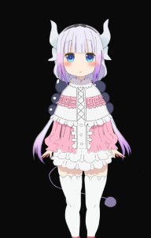  | `<Live2DWidget modelName="kobayaxi" />`             |
| koharu               |      | `<Live2DWidget modelName="koharu" />`               |
| kp31                 |      | `<Live2DWidget modelName="kp31" />`                 |
| live_uu              |   | `<Live2DWidget modelName="live_uu" />`              |
| mai                  |     | `<Live2DWidget modelName="mai" />`                  |
| murakumo             |    | `<Live2DWidget modelName="murakumo" />`             |
| Pio                  | 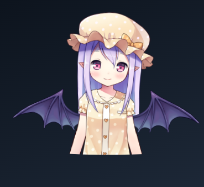    | `<Live2DWidget modelName="Pio" />`                  |
| platelet             | 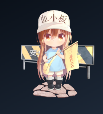   | `<Live2DWidget modelName="platelet" />`             |
| platelet_2           | 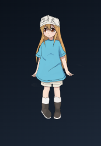    | `<Live2DWidget modelName="platelet_2" />`           |
| potion-Maker-Pio     | 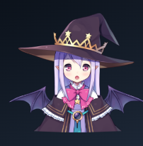  | `<Live2DWidget modelName="potion-Maker-Pio" />`     |
| rem                  |     | `<Live2DWidget modelName="rem" />`                  |
| rem_2                | 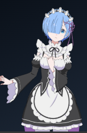       | `<Live2DWidget modelName="rem_2" />`                |
| shizuku              |       | `<Live2DWidget modelName="shizuku" />`              |
| shizuku_48           | 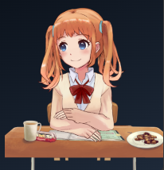     | `<Live2DWidget modelName="shizuku_48" />`           |
| shizuku_pajama       | 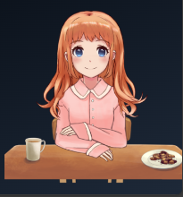     | `<Live2DWidget modelName="shizuku_pajama" />`       |
| terisa               | 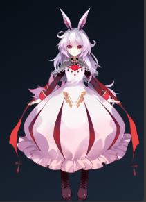      | `<Live2DWidget modelName="terisa" />`               |
| tia                  | 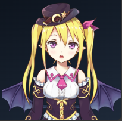     | `<Live2DWidget modelName="tia" />`                  |
| umaru                |     | `<Live2DWidget modelName="umaru" />`                |
| uni                  | 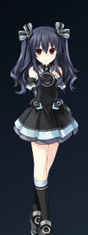       | `<Live2DWidget modelName="uni" />`                  |
| wed_16               | 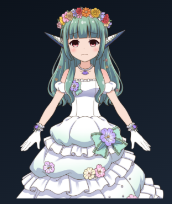     | `<Live2DWidget modelName="wed_16" />`               |
| xisitina             |       | `<Live2DWidget modelName="xisitina" />`             |
| z16                  | 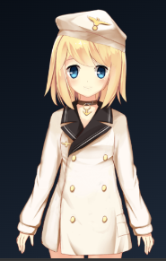       | `<Live2DWidget modelName="z16" />`                  |
| Senko_Normals        |     | `<Live2DWidget modelName="Senko_Normals" />`        |


## 🧑‍💻 Author
Trần Hữu Đang
Website: [https://dangth.dev](https://dangth.dev)

📝 License
[MIT]()
